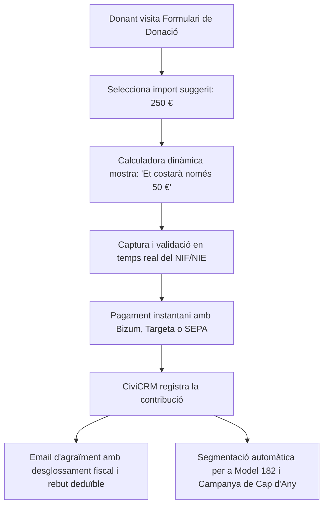

# Com la Deducció Fiscal del 80% Multiplica el Tiquet Mitjà de Donació: Guia Pràctica de Mecenatge amb CiviCRM

Sabies que una donació de **250 € només li costa realment 50 €** a un donant particular a Espanya?

Tot i això, la immensa majoria de fundacions i ONGs continuen cometent el mateix error estratègic: demanen donacions de 30 €, 50 € o 100 € sense explicar amb claredat l'impacte fiscal real. Com a resultat, deixen milers d'euros sobre la taula i perden l'oportunitat d'elevar el compromís de la seva base social.

Amb la reforma de la **Llei 49/2002 de Mecenatge**, el tram de deducció del **80% a l'IRPF es va ampliar fins als primers 250 €** (anteriorment fixat en 150 €). En aquesta guia t'expliquem com utilitzar aquest incentiu com a palanca de captació i com automatitzar-lo tècnicament a **CiviCRM** per multiplicar el tiquet mitjà de les teves campanyes.

---

## 1. La Matriu del Cost Real: De 250 € a 50 €

El principal fre a una aportació més alta és la percepció de despesa immediata. Quan comuniques el **cost net després de la desgravació**, el marc mental del donant canvia completament:

| Donació Nominal | Deducció IRPF (80% fins a 250 €) | **Cost Real per al Donant** |
| :---: | :---: | :---: |
| **50 €** | 40 € (80%) | **10 €** |
| **100 €** | 80 € (80%) | **20 €** |
| **150 €** | 120 € (80%) | **30 €** |
| **250 €** *(Tram òptim)* | **200 € (80%)** | **Només 50 €!** |
| **500 €** | 300 € (200 € al 80% + 100 € al 40%) | **200 €** |

> **La paradoxa del recaptador de fons**: Demanar 250 € explicant que el cost real és de només 50 € sol generar **una taxa de conversió superior** i un tiquet mitjà fins a un 65% més alt que demanar 100 € en fred sense context fiscal.

A més, si el col·laborador manté o incrementa la seva aportació durant 3 anys consecutius, la deducció sobre l'import que superi els 250 € passa del **40% al 45% per fidelitat**.

---

## 2. L'Embut de Conversió Fiscal Automatitzat

Perquè aquest avantatge es tradueixi en donacions reals al teu lloc web, el donant ha de visualitzar l'estalvi fiscal en el mateix instant en què tria l'import:

---

## 3. Tres Tàctiques per Implementar a CiviCRM

### Tàctica 1: Redissenyar els botons d'import amb ancoratge en 250 €
Als teus formularis integrats de CiviCRM (o a la teva passarel·la connectada amb Drupal/WordPress), configura els botons de donació predeterminats amb el càlcul visible:

- `50 €` *(Et costa 10 € després de l'IRPF)*
- `150 €` *(Et costa 30 € després de l'IRPF)*
- **`250 €` — Recomanada** *(Et costa només 50 € després de l'IRPF!)*
- `Altre import`

Destacar el botó de 250 € com a opció principal aprofita el biaix cognitiu d'ancoratge (*anchoring*), orientant la decisió de l'usuari cap al màxim benefici fiscal.

### Tàctica 2: Automatitzar la validació del NIF abans del pagament
Perquè el donant pugui gaudir de la deducció del 80%, l'entitat ha d'incloure el seu NIF al **Model 182**. 

Si deixes el camp de NIF com a opcional, perdràs fins al 40% de les dades fiscals. La bona pràctica a CiviCRM és:
1. Fer que el camp NIF/NIE sigui obligatori als formularis de donació puntual i periòdica.
2. Afegir validació sintàctica en temps real (evita errors tipogràfics en la lletra de control).
3. Recordar sota el camp: *"Imprescindible perquè Hisenda et retorni fins al 80% de la teva donació"*.

### Tàctica 3: La Campanya de "Top-Up" al Desembre
Entre el novembre i el desembre, fes servir els grups intel·ligents (*Smart Groups*) de CiviCRM per identificar tots els donants que hagin aportat entre **50 € i 200 € al llarg de l'any**:

- **Filtre CiviCRM**: Contactes amb donacions totals a l'any en curs `>= 50 €` i `< 250 €`.
- **Missatge**: *"Hola [Nom]! Aquest any ja has col·laborat amb 100 €. Si aportes 150 € més abans del 31 de desembre per completar el tram de 250 €, Hisenda et retornarà 120 € addicionals en la teva propera declaració. El teu cost real d'ampliar el teu ajut avui serà de només 30 €."*

Aquesta campanya de tancament d'exercici aconsegueix taxes d'obertura superiors al 45% i converteix donants ocasionals en donants recurrents d'alt valor.

---

## 4. Llista de Comprovació per Començar

- [ ] Actualitzar els textos i botons de les pàgines de donació destacant la deducció del 80%.
- [ ] Verificar que l'extensió del Model 182 a CiviCRM estigui configurada amb els percentatges vigents de la Llei de Mecenatge.
- [ ] Configurar tokens automàtics a la plantilla de correu de confirmació de CiviCRM mostrant l'import donat i l'import estimat a desgravar.
- [ ] Programar la campanya de "Top-Up de tram fiscal" per al període novembre-desembre.

Vols que auditem els teus formularis de donació i configurem els teus fluxos fiscals automàtics a CiviCRM? A **SmallPush** ajudem fundacions i ONGs a dissenyar embuts de captació d'alt rendiment.
