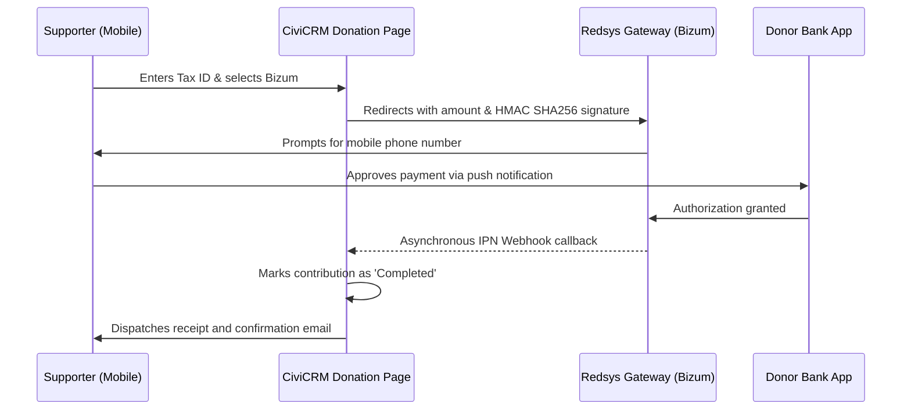

# Integrating Bizum and Redsys with CiviCRM for Nonprofit Donations

In Spain, **Bizum** has become the payment method of choice for mobile users. In charitable fundraising and one-off microdonations, enabling Bizum alongside standard credit card gateways typically increases mobile conversion rates by **25% to 40%**, eliminating the friction of typing card numbers or CVV security codes.

In this guide, we break down the architecture and integration steps to connect **Bizum through Redsys Virtual POS** with your **CiviCRM** deployment.

---

## 1. Why Bizum is Crucial for Mobile Fundraising

- **Frictionless smartphone experience**: Over 70% of social media campaign traffic arrives via mobile. Entering a phone number and confirming via a banking push notification takes under 10 seconds.
- **Immediate microdonations**: Well-suited for emergency appeals, live charity events, and impulse giving.
- **Direct CRM traceability**: Unlike peer-to-peer transfers that lack donor metadata, an integrated Redsys/Bizum payment captures the donor's tax ID (NIF), full name, and email prior to authorization, ensuring compliance with tax certificate regulations.

---

## 2. Integration Architecture: Redsys + Bizum in CiviCRM

For certified organizations, Bizum operates via an institutional donation identifier or through an official **Redsys Virtual POS** configured with the Bizum payment method.

---

## 3. Configuration Steps

1. **Merchant Account with Bizum enabled**: Request a virtual POS from your financial institution with Bizum for NGOs activated.
2. **CiviCRM Redsys Payment Processor**: Install and configure the Redsys extension supporting `HMAC SHA256` encryption and multi-method checkout.
3. **Webhook & IPN Verification**: Ensure server firewalls allow inbound traffic from Redsys notification IP ranges to prevent payment status desynchronization.

Looking to activate Bizum or modernize donation forms in CiviCRM? SmallPush provides rapid end-to-end payment gateway integrations for non-profits.
