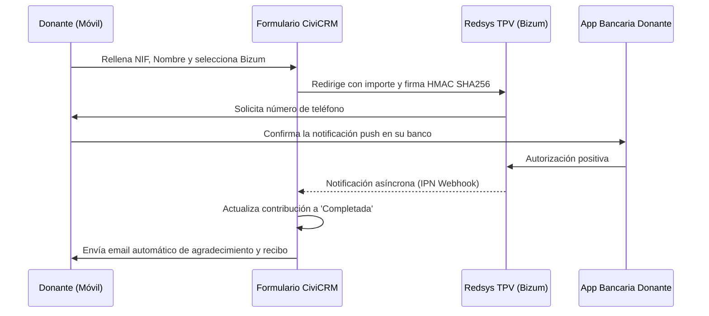

# Cómo Integrar Bizum y Redsys en CiviCRM para Multiplicar Donaciones

En España, **Bizum** se ha convertido en el método de pago favorito para el usuario móvil. En campañas de captación solidaria y microdonaciones puntuales, habilitar Bizum junto a la pasarela tradicional de tarjeta suele incrementar la tasa de conversión en dispositivos móviles **entre un 25% y un 40%**, reduciendo casi por completo la fricción de teclear números de tarjeta o códigos CVV.

En esta guía técnica explicamos la arquitectura y los pasos para integrar **Bizum a través del TPV virtual de Redsys** con tu instalación de **CiviCRM**.

---

## 1. ¿Por qué Bizum es imprescindible para tu captación digital?

- **Cero fricción en smartphones**: Más del 70% del tráfico a campañas solidarias en redes sociales proviene de móviles. Introducir el número de teléfono y confirmar la donación en la app bancaria toma menos de 10 segundos.
- **Microdonaciones inmediatas**: Ideal para campañas de emergencia, eventos presenciales o donaciones impulsivas.
- **Trazabilidad directa al CRM**: A diferencia del Bizum manual entre particulares (donde solo recibes un SMS o apunte sin datos identificativos), una pasarela Redsys con Bizum para ONGs registra el NIF, nombre y correo del donante antes del pago, garantizando que puedas emitir el certificado fiscal.

---

## 2. Arquitectura de Integración: Redsys + Bizum en CiviCRM

Bizum para organizaciones sin ánimo de lucro no funciona como un número de teléfono suelto, sino a través de un **código de donación solidaria** o un **TPV Virtual de Redsys** configurado para admitir el método Bizum.

---

## 3. Pasos de Configuración en CiviCRM

1. **Contratación del TPV Redsys con modalidad Bizum**: Solicita a tu entidad bancaria (CaixaBank, BBVA, Santander, etc.) un TPV virtual que tenga habilitado el método de pago Bizum para donaciones.
2. **Instalación de la Extensión Redsys en CiviCRM**: Instalar la extensión oficial o comunitaria de procesador de pago Redsys con soporte para firma `HMAC SHA256` y selección de métodos de pago en el checkout.
3. **Configuración de URLs de Notificación (IPN)**:
   - Configurar la URL de notificación online para que el servidor de Redsys avise al webhook de CiviCRM cuando el pago se complete.
   - Asegurar que el firewall o el servidor no bloqueen las IPs de los servidores de Redsys.
4. **Página de Contribución y Seguimiento**: Habilitar Bizum en tu formulario de donación (`civicrm/contribute/transact`) y testear el flujo completo en el entorno de pruebas (`sis-t.redsys.es:25443`).

---

## 4. Buenas Prácticas y Conciliación

- **Solicitar siempre NIF y código postal**: Aunque Bizum sea rápido, no prescindas de los campos fiscales si el donante quiere deducirse la aportación en su IRPF (Modelo 182).
- **Procesar devoluciones desde el CRM**: Mantén un registro transparente de cualquier error o cancelación para que las cifras cuadradas coincidan exactamente con el extracto bancario.

¿Quieres activar Bizum en tu web o conectar tus formularios de donación con CiviCRM? En SmallPush te ayudamos a poner en marcha tu pasarela de cobro en tiempo récord.
