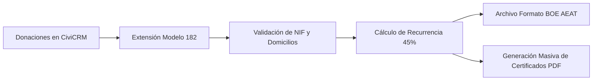

# Guía del Modelo 182 en CiviCRM: Donaciones y Hacienda sin Errores

Para cualquier fundación, asociación u ONG declarada de utilidad pública en España, el **mes de enero** suele ser sinónimo de estrés administrativo: es el momento de presentar el **Modelo 182** ante la Agencia Tributaria (AEAT) y emitir los certificados fiscales de donación para los socios y colaboradores.

En este artículo explicamos cómo configurar y optimizar **CiviCRM** para automatizar el cálculo de deducciones (hasta el 80% en los primeros 250 €), validar NIF/CIFs y generar el archivo oficial que exige Hacienda con un solo clic.

---

## 1. El Marco Fiscal de Donaciones en España (Ley 49/2002)

Desde la última reforma de mecenazgo, los incentivos fiscales por donar a entidades acogidas a la Ley 49/2002 son más atractivos que nunca:
- **Primeros 250 € donados**: 80% de deducción en el IRPF.
- **Resto de donaciones**: 40% de deducción general.
- **Recurrencia (fidelidad)**: Si el donante ha donado importes iguales o superiores en los dos años anteriores a la misma entidad, la deducción sube al **45%**.

Calcular esto manualmente en una hoja de cálculo con cientos o miles de donantes es una fuente constante de discrepancias y sanciones. CiviCRM permite modelar este cálculo de forma determinista.

---

## 2. Requisitos de Datos en CiviCRM para el Modelo 182

Para que el archivo generado sea aceptado por el validador oficial de la AEAT, cada registro de contacto y contribución debe cumplir:

1. **Identificador Fiscal Válido**: NIF o NIE para personas físicas (con letra de control correcta) y CIF para personas jurídicas.
2. **Código de Provincia y Municipio**: Obligatorio según las tablas de codificación del INE.
3. **Tipo de Donación (Clave)**: Dineraria (clave A) o en especie (clave B).
4. **Porcentaje de Deducción y Revocaciones**: Registro de cualquier donación cancelada o devuelta durante el ejercicio fiscal.

---

## 3. Automatización de Certificados de Donación

Uno de los mayores cuellos de botella para los equipos de captación es el envío individual de certificados a cada socio. Con CiviCRM y la extensión de plantillas PDF:
- Se diseña una plantilla corporativa con los datos fiscales de la entidad, el número de registro en el Ministerio y la firma digital.
- Se vincula a un flujo programado (*Scheduled Reminder* o *CiviRules*) para que en cuanto se cierre el ejercicio, cada socio reciba por correo electrónico su certificado en PDF adjunto.

---

## 4. Checklist para Evitar Errores Comunes

- [ ] **Limpieza de NIFs duplicados**: Ejecuta las reglas de deduplicación de CiviCRM en noviembre antes de preparar las remesas finales.
- [ ] **Conciliación bancaria al día**: Asegúrate de que las devoluciones de recibos SEPA de diciembre no se computen como donaciones efectivas.
- [ ] **Validación previa en el portal de la AEAT**: Descarga el fichero generado por CiviCRM y pásalo por el validador en pruebas de la web de la Agencia Tributaria antes del plazo límite del 31 de enero.

¿Tu entidad necesita ayuda para poner a punto su Modelo 182 o migrar su base social a CiviCRM? En SmallPush somos especialistas técnicos en el Tercer Sector español.
