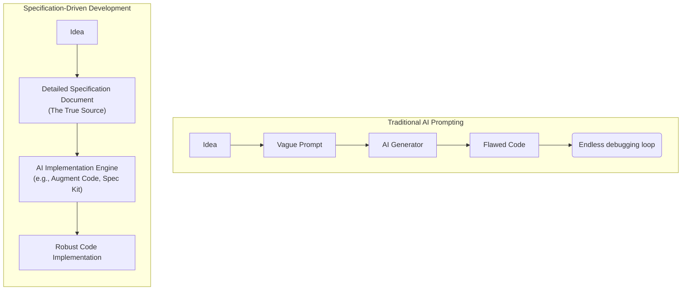

# 🚀 Specification-Driven Development (SDD): The New Paradigm in AI Programming

Software development is experiencing a fundamental shift. For decades, code has been king. However, with the rise of powerful AI coding assistants, a new approach is emerging: **Specification-Driven Development (SDD)**.

## ⚠️ The Problem: The "Vibe Coding" Loop

If you have used AI to write code, you've likely experienced the frustration of going directly from an idea to code via prompts. The AI often produces code that looks almost right but breaks down on architectural details, edge cases, or business logic.

As you try to fix these issues with more prompts, context is lost across sessions, leading to **architectural drift** and tangled codebases. Prompts are ephemeral; they don't capture the entire system intent.

## 🛠️ The Solution: Specification-Driven Development

**Specification-Driven Development (SDD)** is an approach where comprehensive specifications serve as the central source of truth, rather than the code itself.

In this model, specifications are treated as executable blueprints. Instead of converting natural-language prompts directly into code, SDD workflows use specifications to continuously generate and regenerate the implementation.

### The Power Inversion

SDD represents a massive power inversion in software engineering:
*   **Past:** Specifications served the code. We wrote docs to guide development, but code was the ultimate truth.
*   **Present (SDD):** Code serves the specification. The spec is the primary artifact, and the code is merely its expression in a particular language or framework.

## 📊 How SDD Works

Here is a visual representation of the SDD workflow compared to traditional AI prompting:

### Key Components of an SDD Workflow:
1.  **The Constitution:** A foundational document outlining style, formatting, testing approaches, security standards, and architecture patterns.
2.  **The Specification:** Detailed requirements for a specific feature before any implementation starts.
3.  **The Implementation Plan:** An AI-generated, step-by-step plan based on the specification.
4.  **The Code:** The final artifact generated by the AI following the implementation plan.

## 🌟 Benefits of SDD in the Enterprise

*   **Durable Context:** Specifications are persistent, unlike chat prompts, ensuring consistency across large teams and multi-repository architectures.
*   **Reduced Drift:** By maintaining a central blueprint, different developers don't accidentally introduce conflicting architectural patterns.
*   **Focus on Intent:** Developers spend more time refining business logic and user intent, leaving the boilerplate and syntax to the AI.

As AI tools like Augment Code and GitHub Spec Kit mature, maintaining software will increasingly mean evolving specifications rather than manually refactoring code. Welcome to the future of development!
